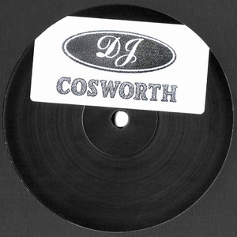

# 🎵 Spotify Clone

A sleek, web-based music player inspired by Spotify, built entirely with HTML, CSS, and JavaScript. Dive into a curated collection of albums, enjoy seamless playback, and experience a responsive interface that mimics the feel of a modern streaming platform.

 <!-- Placeholder for a screenshot if available -->

## ✨ Features

- **🎶 Dynamic Music Library**: Browse and play songs from multiple albums loaded dynamically from JSON data.
- **📱 Responsive Design**: Enjoy a clean, mobile-friendly interface with a collapsible sidebar for easy navigation.
- **▶️ Full Playback Controls**: Play, pause, skip to next/previous tracks, adjust volume, and seek through songs with an interactive progress bar.
- **🎨 Spotify-Inspired UI**: Authentic look and feel with custom icons, gradients, and smooth animations.
- **📂 Album Management**: Click on album cards to load their song lists in the library sidebar.
- **🔄 Seamless Integration**: No external dependencies – runs directly in the browser.

## 🚀 Getting Started

### Prerequisites
- A modern web browser (Chrome, Firefox, Safari, etc.)
- No server required – it's a static web app!

### Installation & Usage
1. **Clone the Repository**:
   ```bash
   git clone https://github.com/your-username/spotify-clone.git
   cd spotify-clone
   ```

2. **Open in Browser**:
   - Simply open `index.html` in your web browser.
   - For the best experience, use a local server (e.g., VS Code Live Server extension) to avoid CORS issues with local file access.

3. **Start Listening**:
   - Browse the album cards on the right panel.
   - Click an album to load its songs in the left sidebar.
   - Hit play and enjoy!

## 🛠️ How It Works

- **Data Source**: Albums and songs are defined in `albums.json`, which includes titles, descriptions, cover images, and song lists.
- **Dynamic Loading**: JavaScript fetches album data and populates the UI with cards and song lists.
- **Playback Engine**: Uses the native HTML5 `<audio>` element for reliable cross-browser audio playback.
- **Responsive Controls**: The play bar includes volume sliders, seekbars, and buttons that update in real-time.

## 📁 Project Structure

```
spotify-clone/
├── index.html          # Main HTML file with app layout
├── style.css           # CSS styles for UI and responsiveness
├── script.js           # JavaScript for functionality and event handling
├── albums.json         # JSON data for albums, songs, and metadata
├── songs/              # Folder containing album subfolders
│   ├── AlbumName/
│   │   ├── cover.jpeg  # Album cover image
│   │   ├── info.JSON   # Additional metadata (optional)
│   │   └── Song.mp3    # Audio files
│   └── ...
├── assets/             # Static assets (images, icons)
│   ├── images/         # Cover images and UI elements
│   └── svgs/           # SVG icons for controls and navigation
├── orginal-code/       # Original directory-fetching code (see below)
└── README.md           # This file
```

## 🔧 Technologies Used

- **HTML5**: Semantic markup for structure.
- **CSS3**: Flexbox, Grid, and custom properties for styling.
- **JavaScript (ES6)**: DOM manipulation, event handling, and audio API.
- **JSON**: For data storage and configuration.

## 📖 Original Code Approach

This project includes an `orginal-code/` folder with the initial implementation that fetched songs directly from local directories via HTTP requests. This method works great locally but isn't compatible with static hosting platforms like GitHub Pages.

The current version uses a JSON-based approach for better portability. Check out `orginal-code/readme.md` for details on switching to the original method if needed for local development.

## 🤝 Contributing

Contributions are welcome! Feel free to:
- Report bugs or suggest features via Issues.
- Submit pull requests for improvements.
- Star the repo if you find it useful! ⭐

## 📄 License

This project is licensed under the MIT License – see the [LICENSE](LICENSE) file for details.

## 🙏 Acknowledgments

- Inspired by Spotify's design and user experience.
- Sample songs and assets are for demonstration purposes only.
- Icons and images sourced from free resources.

---

Enjoy the music! 🎧 If you have any questions or feedback, open an issue or reach out. Let's build something awesome together!
